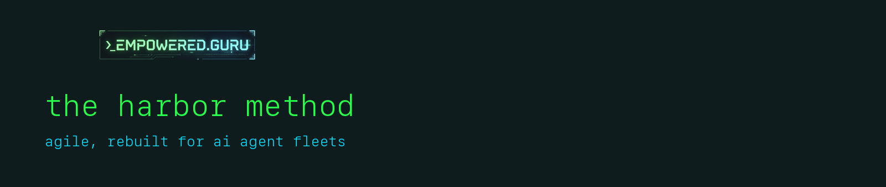

A working operating model for running a fleet of AI agents. Not Scrum with
robot standups. The agile values, translated one layer down, and shipped in
production.

```
● live in production · open-core · cc by-sa 4.0 · by empowered.guru
```

Scrum was built to solve *human* frictions: expensive context-switching,
drift, variable estimates, burnout. Agents do not have those problems, and
they fail in ways Scrum never anticipated: drift, orphaned runs,
hallucinated self-reports. The Harbor Method translates what Agile was
*for*, one layer down, and names the one piece nobody has shipped.

---

## // the manifesto

Every line of the original maps to a direct agent translation.

| original agile value | agent translation |
|---|---|
| working software over documentation | **verified outcomes over self-reported claims.** "it works" is not evidence. a green check plus a receipt is. |
| individuals and interactions over processes | **capability contracts over personas.** organize around what each agent can *do* and the contract it must satisfy, not a role that goes stale. |
| responding to change over following a plan | **event-driven dispatch over fixed timeboxes.** agents do not need sprints. they need triggers. |

The bottleneck moved. Agile optimizes **human attention**; agent systems
optimize **verification, context budget, and cost**. Build for the thing
that actually breaks.

## // the loop

Eight stages. The first seven are engineering. The eighth is the part
nobody has shipped.

```
 intake ── claim ── isolate ── work ── verify ── ship ── log
    │                                                     │
    └──────────────────── improve ◄───────────────────────┘
                              * the retro, as a routine
```

| # | stage | what it actually is |
|---|---|---|
| 1 | **intake** | a trigger admits a unit of work into the queue |
| 2 | **claim** | an atomic claim + ttl. the ttl *is* the wip limit |
| 3 | **isolate** | a per-run workspace. branch-per-story, never a shared tree |
| 4 | **work** | the budget is reserved *before* dispatch, never discovered mid-run |
| 5 | **verify** | a machine-checkable gate is the definition of done |
| 6 | **ship** | merge/deploy once green. continuous delivery |
| 7 | **log** | a digest classifies every run's health. the standup, automated |
| 8 | **improve** | * the retrospective as a routine. the loop that compounds |

## // the crew

Scrum's `PO + SM + devs + test` collapses to three. The Scrum Master
dissolves: coordination is a ledger, not a person.

- **orchestrator**: decompose goals, keep work unblocked
- **worker**: execute inside an isolated, budgeted envelope
- **verifier**: the gate *and* the retro

Plus one addition that closes the gap: the **bosun**, the officer who keeps
a ship's rigging in working order. It owns the loop that makes the fleet
get better each cycle.

## // the skills

The adoptable layer. Four role contracts plus the retro runbook, written
so you can copy them into your own fleet today.

- [`skills/orchestrator`](skills/orchestrator/SKILL.md): decompose goals, keep work unblocked
- [`skills/worker`](skills/worker/SKILL.md): execute inside a budgeted envelope
- [`skills/verifier`](skills/verifier/SKILL.md): the gate and the retro
- [`skills/bosun`](skills/bosun/SKILL.md): own the self-improvement loop
- [`skills/retro`](skills/retro/SKILL.md): the retrospective, as a routine

Index: [`skills/README.md`](skills/README.md)

## // what is open, and what is not

This repo is a philosophy and a framework, not an implementation.

**open and free**: the thinking. The values, the loop, the roles, the
retro concept, the translation tables. Use them, adapt them, ship with
them. Generosity is how you find the people who need the deeper thing.

**gated**: the operational layer. The contract schemas, the
intake/claim/isolation/budget runtime, the machine-actionable record
format, the watchdogs, the ledger wiring. That is the hard, expensive
twenty percent that took real production failures to learn, and it is the
part we build and operate for clients.

The map is free. The engines are a service.

→ **[empowered.guru](https://www.empowered.guru)**: we run fleets of AI
employees for startups this way.

## // read the thinking

- Full essay: [`docs/the-harbor-method.md`](docs/the-harbor-method.md)
- Short version: **[Agile is broken for AI agents](https://www.empowered.guru/blog/agile-is-broken-for-ai-agents-heres-what-i-use-instead)**

## // author

**Brian Marvin**. Founder, Empowered Business Solutions
([empowered.guru](https://www.empowered.guru)). Written from running a fleet
of AI agents in production, not from theory.

## // license

[CC BY-SA 4.0](LICENSE). The writing is free to share and adapt with
attribution. The operational implementation it describes is not included
here.